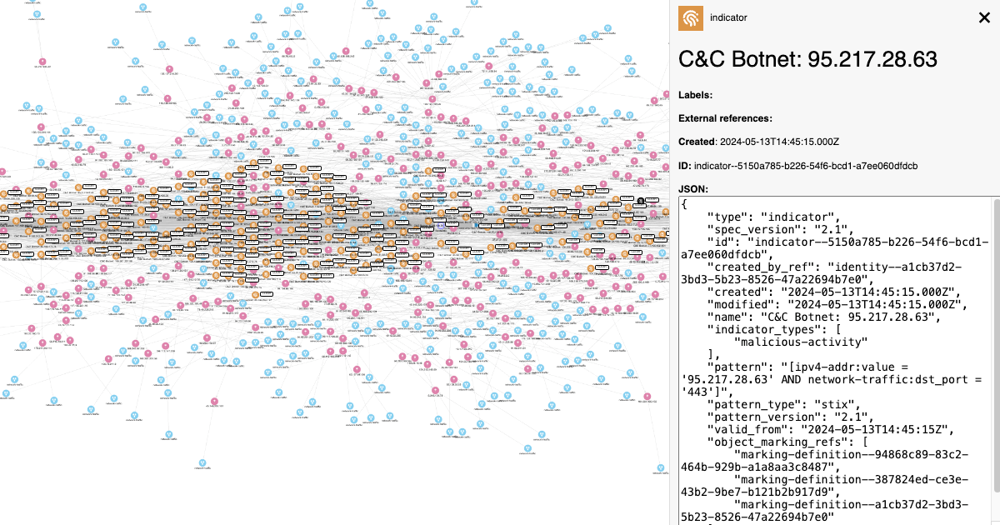

# feeds2stix

## Overview



A set of scripts that take data from threat intelligence feeds and convert them it into STIX 2.1 objects.

The aim of this repository is to demonstrate how easy it is for anyone to get structured cyber threat intelligence as STIX 2.1 objects into downstream tools.

We mainly use this repository to generate real examples we can use to test our other tooling. All content in this repo should be considered at proof-of-concept

## Structure of this repository

The key parts of this repository are structured as follows;

```txt
.
├── examples/ # examples of processor output
│   ├── producer1/
│   │   └── bundle.json
│   └── producer2/
│       └── bundle.json
├── processors/
│   ├── producer1/
│   │	├── README.md # describes the mapping of the feed.py files
│   │	├── feed1.py
│   │   └── feed2.py
│   └── producer2/
│    	├── README.md
│    	└── feed1.py 
└── bundles/ # will only exist after one script has been run
    ├── producer1/
    │	├── feed1
    │	│	├── bundle1.json # multiple bundles can be produced for a single feed (e.g. seperated by threat actor)
    │	│	└── bundle2.json
    │	└── feed2
    │		├── bundle1.json
    │		└── bundle2.json
    └── producer2/
     	└── feed1
    		└── bundle1.json
```

The `processors` directory contains the scripts that generate the data. These scripts output the data they create into the `bundles` directory (this directory will only exist once you run one of the processor scripts).

To give you can idea of what the data for each script looks like, we've included an `examples` directory containing output bundles.

## Adding new processors

Installing the script

To install crypto2stix;

```shell
# clone the latest code
git clone https://github.com/muchdogesec/feeds2stix
# create a venv
cd feeds2stix
python3 -m venv feeds2stix-venv
source feeds2stix-venv/bin/activate
# install requirements
pip3 install -r requirements.txt
```

## Useful supporting tools

* [This repository contains Open Source freely usable Threat Intel feeds that can be used without additional requirements. Contains multiple types such as IP, URL, CVE and Hash.](https://github.com/Bert-JanP/Open-Source-Threat-Intel-Feeds)

## Support

[Minimal support provided via the DOGESEC community](https://community.dogesec.com/).

## License

[Apache 2.0](/LICENSE).